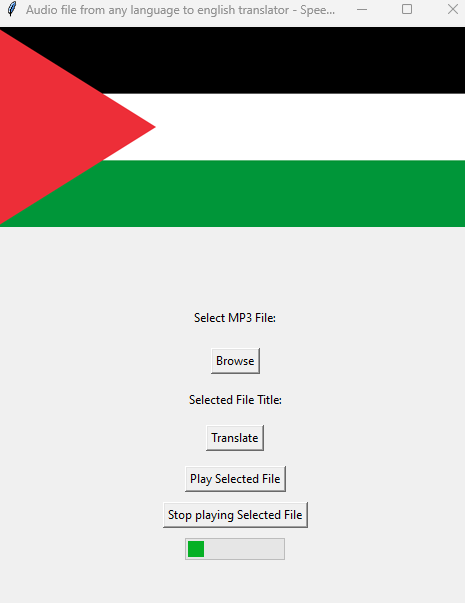

# Audio file any language to english translator Speech To Speech Translator

Audio file any language to english translator Speech To Speech Translator is a simple tool that allows you to translate the content of an Audio file using OpenAI's Whisper ASR and TTS models.

## Features

- Translate the content of an Audio file from any language to english.
- Uses OpenAI's Whisper models for audio processing and translation.
- User-friendly GUI for easy interaction.

## Requirements

Make sure you have the following dependencies installed:

- Python 3.x
- Pip (Python package installer)

Install the required Python packages using:

```bash
pip install -r requirements.txt
```

## Usage

Run the Script:

```bash
python Audio_file_any_language_to_english_translator-SpeechToSpeechTranslator.py
```

Select an MP3 File:
	Click the "Browse" button to choose an MP3 file.
	You can use 'segment_1.mp3' as example (with a spanish voice)

Translate Speech:
	Click the "Translate" button to translate the speech to English.

Save Translated Audio:
	Choose a save location using the "Save" dialog.


## GUI Preview



## Configuration

- You can customize the translation model and other settings by modifying the script.

## Logging

- The script logs translation results and errors to a log file named log.txt.

## License

This project is licensed under the [MIT License](https://opensource.org/licenses/MIT) - see the [LICENSE](LICENSE) file for details.