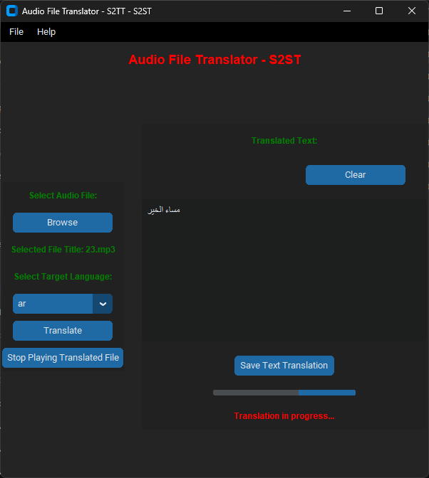

# Audio file translator - Speech To Speech Translator

Audio file translator, Speech To Speech Translator is a tool that allows you to translate the content of an Audio file using:
 - S2T: OpenAI's Whisper multilingual [whisper-large-v2](https://huggingface.co/openai/whisper-large-v2),
 - T2T: Google Speech Recognizer
 - TTS: Python gtts

## Features

1. Multi-Language Support

   - The translator supports various target languages, including English, Spanish, French, German, Japanese, Korean, Turkish, Arabic, Russian, Hebrew, Hindi, Italian, and Portuguese.

2. YouTube Downloader

   - Integrated YouTube downloader for downloading audio from YouTube videos. Users can choose between MP3 and MP4 formats.

3. Audio Conversion Tools

   - Convert Audio to MP3: Converts audio files to the MP3 format.
   - Extract Audio from Video: Extracts audio from video files and saves it as an MP3 file.

4. Memory Management Improvements

   - Improved memory management for better performance, especially with large audio files.
   - Added support for translating large audio files without running out of memory.

5. FFMpeg Integration

   - FFMpeg is utilized to split large audio files, preventing out-of-memory errors and enhancing translation quality.

6. MP4 to MP3 Converter

   - A tool to convert MP4 files to MP3 format.

7. YouTube Video Translation

   - Translate audio content from YouTube videos to different languages.

8. GUI Improvements

   - Updated GUI style for a more user-friendly experience.
   - Stop button to halt the playback of translated audio files.

9. Version History

  - v1.0: Initial version.
  - v1.1: Improved memory management, support for large audio files, FFMpeg integration, audio-to-MP3 conversion, and GUI updates.
  - v1.2: Fixed audio-to-MP3 conversion, added MP4 to MP3 converter, and introduced YouTube downloader.

## Requirements

Make sure you have the following dependencies installed:

- Python 3.x
- Pip (Python package installer)
- [FFmpeg](https://ffmpeg.org/download.html)


## Dependencies

- pygame: Used for audio playback.
- transformers: OpenAI's Whisper for speech-to-text translation.
- gtts: Google Text-to-Speech for text-to-speech conversion.
- torchaudio: Audio processing library.
- pydub: Audio processing library.
- pytube: YouTube video download library.
- PIL: Python Imaging Library for image processing.

## Usage

1- Clone the repository:
```bash
git clone https://github.com/overcrash66/Audio-File-Translator---S2ST.git
```

2- Install the required Python packages using:

```bash
pip install -r requirements.txt
```

3- Run the Script:

```bash
python AudioFileTranslator-S2ST.py
```

1- File Menu:
- Convert Audio file to MP3
- Extract audio from Video
- YouTube Downloader
- Exit

2- Help Menu:
- About

3- Select Audio File:
- Browse to choose the input audio file.

4- Select Target Language:
- Choose the target language from the dropdown menu.

5- Translate:
- Click the "Translate" button to start the translation process.

6- Stop Playing Translated File:
- Click the "Stop Playing Translated File" button to stop audio playback.


## GUI Preview



## Configuration

- You can customize the translation model and other settings by modifying the script.

## Logging

- The script logs translation results and errors to a log file named log.txt.

## License

This project is licensed under the [MIT License](https://opensource.org/licenses/MIT) - see the [LICENSE](LICENSE) file for details.